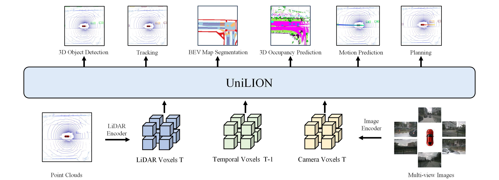

<div align="center">

###  [UniLION: Towards Unified Autonomous Driving Model with Linear Group RNNs](http://arxiv.org/abs/2511.01768)

[Zhe Liu](https://happinesslz.github.io) <sup>1, 2</sup>,
[Jinghua Hou](https://github.com/AlmoonYsl) <sup>1</sup>,
[Xiaoqing Ye](https://shuluoshu.github.io)  <sup>3</sup>,
[Jingdong Wang](https://jingdongwang2017.github.io) <sup>3</sup>,
[Hengshuang Zhao](https://hszhao.github.io) <sup>2,✉</sup>,
[Xiang Bai](https://xbai.vlrlab.net) <sup>1,✉</sup>
<br>
<sup>1</sup> Huazhong University of Science and Technology,
<sup>2</sup> The University of Hong Kong,
<sup>3</sup> Baidu Inc.
<br>
✉ Corresponding author.
<br>



</div>

## 🔥 Highlights

* **Unified Heterogeneous Inputs**. UniLION integrates multi-view images, LiDAR point clouds, and temporal information into a unified 3D backbone through direct token concatenation without hand-crafted fusion modules.  💪

* **Unified Model**. UniLION enables parameter sharing across different input formats. Specifically, once trained with multi-modal temporal data, the same UniLION model can be directly deployed across different sensor configurations and temporal settings (e.g., LiDAR-only, temporal LiDAR, or multi-modal fusion) without retraining. 💪

* **Unified Representation**. UniLION highly compresses heterogeneous multi-modal and temporal information into a compact BEV feature representation that serves as a shared strong representation for autonomous driving. 💪

* **Strong performance**. UniLION achieves competitive and SOTA performance across comprehensive autonomous driving tasks including 3D perception, motion prediction, and planning. 💪

## News
* **2025.11.04**: UniLION paper released. 🔥

## Results
* **nuScenes Validation Set**

| Model        | Modality |  NDS |  mAP |  AMOTA   |  mIoU   |  RayIoU   |  minADE (Car/Ped.)  |  L2   |  Col.   | Config | Checkpoint |
|--------------|:--------:|:----:|:----:|:--------:|:-------:|:---------:|:---------:|:-----:|:------:|:------:|:----------:|
|    UniLION   |     L    | 72.3 | 67.5 |   72.6   |   71.7  |   46.8    | - | - | - | - | - |
|    UniLION   |     LT   | 73.0 | 68.9 |   73.3   |   72.4  |   49.6    | 0.58 / 0.39 | 0.60 | 0.27 | - | - |
|    UniLION   |     LC   | 74.9 | 72.2 |   76.2   |   72.3  |   50.8    | - | - | - |[config](https://github.com/happinesslz/UniLION/blob/main/projects/configs/unilion_swin_384_perception.py)| - |
|    UniLION   |     LCT  | 75.4 | 73.2 |   76.5   |   73.3  |   51.3    | 0.57 / 0.37 | 0.65 | 0.18 |[config](projects/configs/unilion_swin_384_seq_e2e.py)| [model](https://drive.google.com/file/d/18fpw-EJ-eJikVPczoRqyhLnXjJzjOnpv/view?usp=drive_link) |

* **3D Object Detection**
  
| Model        | Modality |  NDS |  mAP |
|--------------|:--------:|:----:|:----:|
|    UniLION   |     L    | 72.3 | 67.5 |
|    UniLION   |     LT   | 73.0 | 68.9 |
|    UniLION   |     LC   | 74.9 | 72.2 |
|    UniLION   |     LCT  | 75.4 | 73.2 |

* **Multi-object Tracking**
  
| Model        | Modality |  AMOTA |  AMOTP | IDS |
|--------------|:--------:|:------:|:------:|:---:|
|    UniLION   |     L    | 72.6 | 0.542 | 510 |
|    UniLION   |     LT   | 73.3 | 0.515 | 537 |
|    UniLION   |     LC   | 76.2 | 0.499 | 711 |
|    UniLION   |     LCT  | 76.5 | 0.477 | 613 |

* **BEV Map Segmentation**
  
| Model        | Modality | mIoU |
|--------------|:--------:|:-----:
|    UniLION   |     L    | 71.7 |
|    UniLION   |     LT   | 72.4 |
|    UniLION   |     LC   | 72.3 |
|    UniLION   |     LCT  | 73.3 |

* **3D Occupancy Prediction**
  
| Model        | Modality | RayIoU |
|--------------|:--------:|:-------:
|    UniLION   |     L    |  46.8  |
|    UniLION   |     LT   |  49.6  |
|    UniLION   |     LC   |  50.8  |
|    UniLION   |     LCT  |  51.3  |

* **Motion Prediction**
  
| Model        | Modality | minADE (Car) | minADE (Ped) | EPA |
|--------------|:--------:|:------------:|:------------:|:---:|
|    UniLION   |     LT   | 0.58 | 0.39 | 0.647 |
|    UniLION   |     LCT  | 0.57 | 0.37 | 0.678 |

* **Planning**
  
| Model        | Modality | L2 (1s)	| L2 (2s)	| L2 (3s)	| L2 (avg)	| Col. (1s)	| Col. (2s)	| Col. (3s)	| Col. (avg) |
|--------------|:--------:|:-------:|:-------:|:-------:|:---------:|:---------:|:---------:|:---------:|:----------:|
|    UniLION   |     LT   | 0.35 | 0.67 | 1.09 | 0.70 | 0.01 | 0.20 | 0.60 | 0.27 |
|    UniLION   |     LCT  | 0.33 | 0.62 | 0.99 | 0.65 | 0.01 | 0.12 | 0.42 | 0.18 |


## Installation
Please refer to [INSTALL.md](docs/INSTALL.md) for the installation of UniLION codebase.


## Getting Started
### Train UniLION on nuScenes
```shell script
# First stage

tools/dist_train.sh projects/unilion_swin_384_det_map.py 8

# Second stage

tools/dist_train.sh projects/unilion_swin_384_seq_perception.py 8

# Third stage

tools/dist_train.sh projects/unilion_swin_384_seq_e2e.py 8
```
Note: for better performance, you can additionly train 3D object detection for providing the pretrained model in the first stage.
```shell script
tools/dist_train.sh projects/unilion_swin_384_det.py 8
```

### Test UniLION on nuScenes
  
You can freely select the tasks to be evaluated in the config.

```shell script
tools/dist_test.sh projects/<CONFIGS> 8 <CKPT> --eval mAP
```

Besides, you can use our released model ([UniLION model](https://drive.google.com/file/d/18fpw-EJ-eJikVPczoRqyhLnXjJzjOnpv/view?usp=drive_link)) to evaluate all results:

```shell script
tools/dist_test.sh projects/projects/configs/unilion_swin_384_seq_e2e.py 8 <CKPT> --eval mAP
```

## TODO
- [x] Release the paper.
- [x] Release the code of UniLION.
- [x] Release checkpoints of UniLION.

## Citation
```
@article{liu2024lion,
  title={LION: Linear Group RNN for 3D Object Detection in Point Clouds},
  author={Zhe Liu, Jinghua Hou, Xingyu Wang, Xiaoqing Ye, Jingdong Wang, Hengshuang Zhao, Xiang Bai},
  journal={Advances in Neural Information Processing Systems},
  year={2024}
}

@article{liu2025unilion,
  title={UniLION:Towards Unified Autonomous Driving Model with Linear Group RNNs},
  author={Zhe Liu, Jinghua Hou, Xiaoqing Ye, Jingdong Wang, Hengshuang Zhao, Xiang Bai},
  journal={arXiv preprint arXiv:2511.01768},
  year={2025}
}
```

## Acknowledgements
We thank these great works and open-source repositories: [LION](https://github.com/happinesslz/LION),
[MMDectection](https://github.com/open-mmlab/mmdetection3d), [SparseDrive](https://github.com/swc-17/SparseDrive), [Mamba](https://github.com/state-spaces/mamba), [RWKV](https://github.com/BlinkDL/RWKV-LM), [Vision-RWKV](https://github.com/OpenGVLab/Vision-RWKV), and [flash-linear-attention](https://github.com/sustcsonglin/flash-linear-attention).
